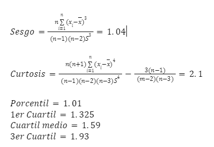
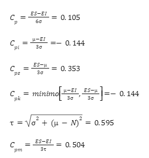

## 1. Construcción de aviones de papel y lanzador
El modelo del avión, conocido como Silvio, es muy sencillo de armar y en pocos pasos estará listo para volar. Para mejorar su vuelo, se diseñó un lanzador de aviones simple y eficaz. 

  
  

## 2. Lanzamiento
### Recopilación de datos y repitibilidad 
Una vez armado el avión Silvio y el lanzador, se realizaron pruebas con un total de 20 aviones. Cada avión fue lanzado cuatro veces desde una altura de 1.50 metros y con una inclinación de 45º.

  
  

  ### Diagrama de pareto
Después de recopilar los datos, se analizaron los factores que afectan el tiempo y la distancia del lanzamiento de los aviones de papel: tipo de hoja, daños al avión, tipo de dobleces e inclinación de las alas.

Se creó una tabla de frecuencia para cada categoría, se calcularon los porcentajes y se ordenaron de mayor a menor frecuencia. Luego, se calculó el porcentaje acumulado y se generó un diagrama de Pareto. Este mostró que solucionando las dos principales inconformidades (inclinación de las alas y arrugas en la hoja) se resolvería el 80% de los problemas.

  
  
  

    
  

### Diagrama de Ishikawa
Para mejorar el proceso de armado se necesitan herramientas y restricciones de medida para reducir defectos, como las asimetrías. Usar hojas nuevas y gruesas que no tengan defectos mejorará el rendimiento. Además, solo se deben admitir aviones con las alas perfectamente rectas.
 

    
  

### Medidas de dispersión
Se Determina el rango de datos identifica el valor mínimo y máximo de tus datos. se decide el numero de intervalos y el limite inferior y superior, se cuentan las Frecuencias y se crea el Histograma

 

    
  

### Histogramas

   

    
  

 

    
  

### Cartas de control
Evaluar la habilidad o capacidad de un proceso consiste en conocer la amplitud de la variación natural de este para una característica de calidad dada, lo cual permitirá saber en qué medida tal característica de calidad es satisfactoria. Se prosiguió a calcular el Cp, Cpk, Cpm y Ppm mediante las siguientes fórmulas

 

    
  

   

    
  
