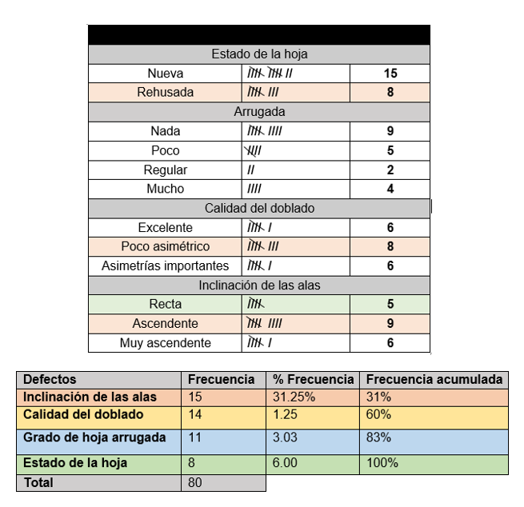
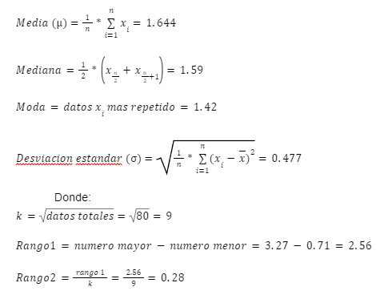

## 1. Construcción de aviones de papel y lanzador
El modelo del avión, conocido como Silvio, es muy sencillo de armar y en pocos pasos estará listo para volar. Para mejorar su vuelo, se diseñó un lanzador de aviones simple y eficaz. 
  

  

## 2. Lanzamiento
### Recopilación de datos y repitibilidad 
Una vez armado el avión Silvio y el lanzador, se realizaron pruebas con un total de 20 aviones. Cada avión fue lanzado cuatro veces desde una altura de 1.50 metros y con una inclinación de 45º.

   

   

  ### tablas de frecuencia
Se elaboraron tablas de frecuencia con el objetivo de clasificar los datos obtenidos sobre los daños ocurridos durante la fabricación del avión, así como los daños que se fueron generando a lo largo de cada lanzamiento. En estas tablas se registraron las frecuencias de los diferentes tipos de daños específicos observados.

   

   

### Diagrama de pareto
Se realizó un diagrama de Pareto para identificar y priorizar los problemas a resolver, con el fin de mejorar el rendimiento y la distancia recorrida por los aviones. Los resultados mostraron que el 31.25% de los defectos se debieron a la inclinación de las alas y el 1.25% a errores en la calidad del doblado. El porcentaje acumulado de estos dos tipos de defectos es del 32.50%. Por lo tanto, se concluyó que la mayor mejora en el proceso se puede lograr resolviendo los problemas relacionados con la inclinación de las alas y la calidad del doblado.

  

    
  

### Diagrama de Ishikawa
Se elaboró un diagrama de Ishikawa con el fin de identificar las diversas causas de los defectos en la fabricación de aviones de papel, centrándose en el efecto que tuvo el mayor impacto. Se llegó a la conclusión de que, para mejorar el proceso de armado, se necesitan herramientas y restricciones de medida para reducir defectos, como las asimetrías. El uso de hojas nuevas y gruesas, mejorará el rendimiento. Además, solo se deben admitir aviones con las alas perfectamente rectas.

 

    
  

### Medidas de dispersión
Se determinaron diversas medidas de dispersión, tales como la media, mediana, moda y desviación estándar, con el objetivo de obtener información sobre el grado de variabilidad de una variable, que este caso es el tiempo de vuelo del avión. De esta manera, se puede conocer la posición de estos parámetros dentro de la distribución.

 

    
  

### Histogramas
Se creó un histograma para simbolizar cómo se distribuye el tiempo de vuelo, identificando picos, tamaño de muestra, asimetrías, valores atípicos, ajuste, centros, dispersiones, valores mínimos y máximos, entre otros. La imagen muestra que la distribución de los datos es uniforme o normal, con un pico en torno a los 1.71 segundos. Podemos observar que el rango mínimo y máximo es de 0.28 y 2.56 segundos, respectivamente. La cola se extiende a la derecha, indicando un sesgo positivo. La curtosis muestra que la curva de distribución es más empinada en el centro y con colas relativamente largas.

El primer percentil (10%) es de 1.01, indicando que el 10% de las mediciones son menores o iguales a este valor. El cuartil medio, equivalente a la mediana, es de 1.59. Finalmente, el tercer percentil (95%) es de 1.93, lo que indica que el 95% de las mediciones son menores a este valor.

 

    

   

  

Los límites observados se deben a las especificaciones del cliente. De acuerdo con estas especificaciones, la mayoría de los datos se encuentran fuera de los límites de especificación. Solo 23 de los 80 aviones cumplen con el tiempo de vuelo requerido. 

### Cartas de control
Se realizo una carta de control para evaluar la estabilidad del proceso de elaboracion, tiempo de vuelo y distancia recorrida. los Se prosiguió a calcular el Cp, Cpk, Cpm y Ppm mediante las siguientes fórmulas y los datos que se onbtuvieron fue que el proceso no cumple con las especificaciones y requiere modificaciones serias.

  

    
  

  
   

    
  

